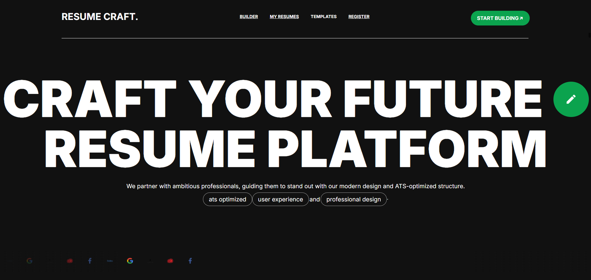
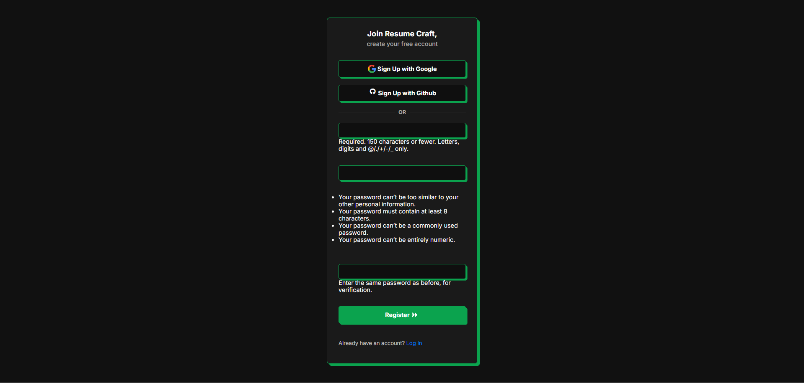
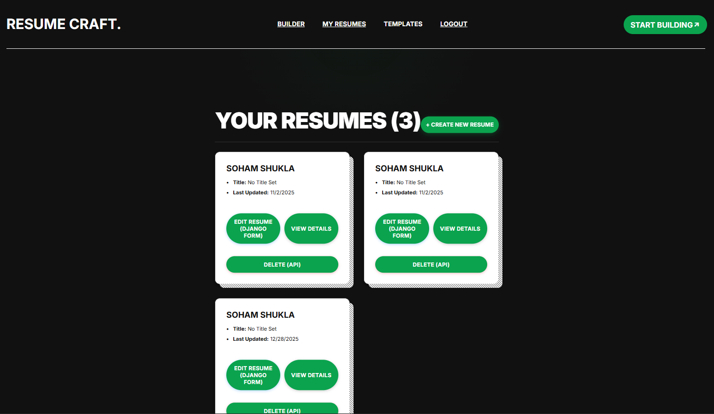
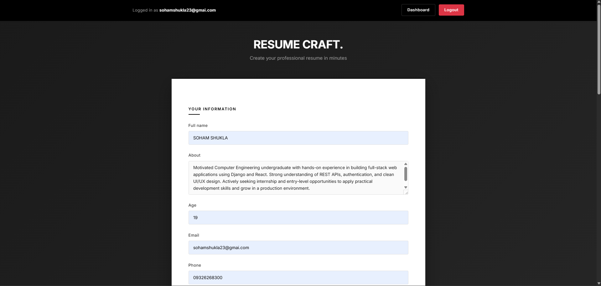
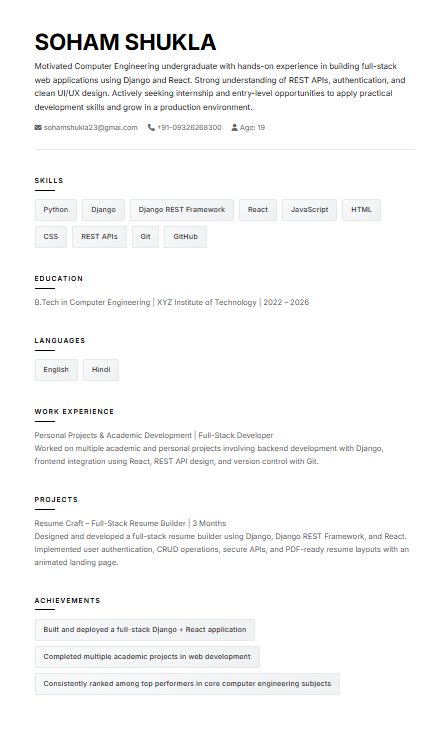

# Resume Craft  
### Full-Stack Resume Builder — Django REST + React

<p align="center">
  
  
  
  
  
</p>

<p align="center">
  <em>
    Resume Craft is a full-stack resume builder application demonstrating secure authentication,
    RESTful APIs, and modern frontend-backend integration using Django and React.
  </em>
</p>

---

## Executive Summary

> **Project Type:** Full-Stack Web Application  
> **Architecture:** Django REST Framework + React  
> **Primary Use Case:** Resume creation, management, and rendering  
> **Focus Areas:** Authentication, CRUD workflows, API integration, frontend state handling

---

## Overview

Resume Craft allows users to **register, authenticate, and manage resumes** through a clean React interface powered by a secure Django REST backend.  
The project focuses on **real-world full-stack patterns**, including CSRF protection, session-based authentication, API-driven UI updates, and maintainable project structure.

This repository is intended as:
- A **portfolio-grade project**
- A **learning reference** for Django + React integration
- A **foundation** for extending into production-ready systems

---

## 🖼️ Screenshots

### Landing Page


### Authentication



### User Dashboard


### Resume Builder


### Resume Preview


---

## Core Features

- Secure **user authentication** (login & registration)
- Full **CRUD functionality** for resumes
- Django REST Framework–based API architecture
- CSRF-protected frontend-backend communication
- React-driven UI with component-based design
- Print- and PDF-friendly resume templates
- Admin interface for managing user data
- Clean separation of backend and frontend concerns

---

## Technology Stack

### Backend
- Python
- Django
- Django REST Framework
- Session-based authentication
- SQLite (easily extendable to PostgreSQL/MySQL)

### Frontend
- React
- JavaScript (ES6+)
- Axios
- Webpack

### Tooling & Practices
- Git & GitHub
- Virtual environments
- Environment-based configuration
- Modular project structure

---

## Project Structure

```tree
soham334-resume-craft/
├── README.md
├── LICENSE
└── resume_builder_project/
    ├── README.md
    ├── manage.py
    ├── frontend/
    │   ├── package.json
    │   ├── webpack.config.js
    │   └── src/
    │       ├── index.jsx
    │       ├── components/
    │       │   ├── BuilderDashboard.jsx
    │       │   ├── LandingPage.jsx
    │       │   └── ResumeApp.jsx
    │       └── utils/
    │           ├── api.jsx
    │           └── csrf.jsx
    ├── resume_builder_project/
    │   ├── settings.py
    │   ├── urls.py
    │   ├── asgi.py
    │   └── wsgi.py
    └── resumesite/
        ├── models.py
        ├── views.py
        ├── serializers.py
        ├── urls.py
        ├── templates/
        └── static/
```

⚙️ Setup & Installation
Prerequisites

Python 3.10 or higher

Node.js and npm

Backend Setup (Django)
# Clone the repository
git clone https://github.com/Soham334/Resume-Craft.git
cd resume_builder_project

# Create and activate virtual environment
python -m venv venv
venv\Scripts\activate          # Windows
# OR
source venv/bin/activate       # Linux / macOS

# Install dependencies
pip install -r requirements.txt

# Apply database migrations
python manage.py migrate

# Create admin (superuser)
python manage.py createsuperuser

# Run development server
python manage.py runserver


Backend will be available at:
http://127.0.0.1:8000/

Frontend Setup (React)
cd frontend
npm install
npm run build

📄 Usage

Register or log in as a user

Create, edit, and manage resumes

View structured resume output

Admin users can manage records via Django Admin

🧪 Testing

Run backend tests:

python manage.py test resumesite

🚀 Roadmap & Enhancements

JWT-based authentication

Resume template customization

Automated PDF export

Docker-based deployment

Cloud hosting (AWS / Render / Railway)

📄 License

This project is licensed under the MIT License.
See the LICENSE file for details.

<p align="center"> <em> Built to demonstrate practical full-stack development using Django and React, with emphasis on clean architecture and secure workflows. </em> </p> <p align="center">  </p> ```
